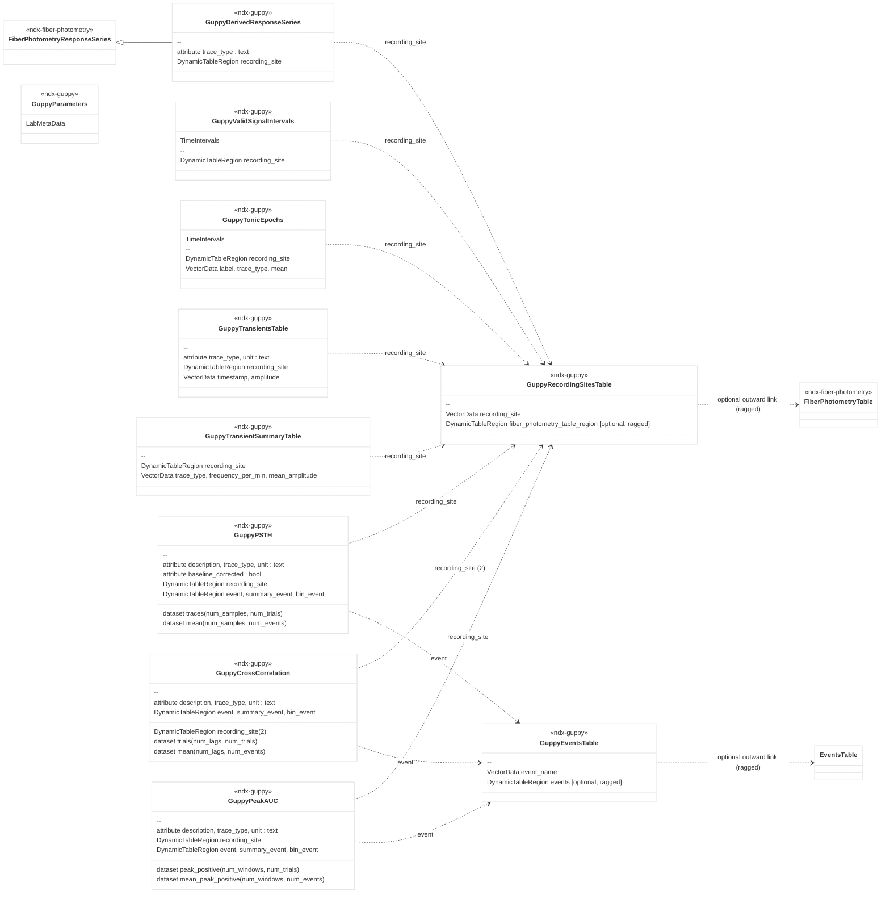

# ndx-guppy Extension for NWB

This is an NWB extension for storing the derived outputs of the [GuPPy](https://github.com/LernerLab/GuPPy)
(Guided Photometry Analysis in Python) fiber-photometry processing tool.

GuPPy is a *processing* tool, not an acquisition system. This extension represents only the products GuPPy
computes — normalized traces, detected transients, peri-event PSTHs, cross-correlations, and the parameters
used — for a single session. Raw signal/control traces and behavioral events remain owned by the acquisition
and events interfaces (e.g. [ndx-fiber-photometry](https://github.com/catalystneuro/ndx-fiber-photometry) and
pyNWB's core `EventsTable`).

The design turns GuPPy's organizing features into structured, queryable NWB features:

- **recording_site** and **event** are *entities*, so they live as rows in registry tables
  (`GuppyRecordingSitesTable`, `GuppyEventsTable`) and are referenced by `DynamicTableRegion`. Recording-site
  and event identity is defined once and referenced everywhere — no free-text strings to keep in sync.
- **trace_type** is a closed *category* (`control_fit` / `dff` / `z_score`), so it is a plain enumerated text
  attribute stamped directly on each object.
- **event** is the one *unbounded* axis (you can align to arbitrarily many behavioral events), so the
  event-bearing products (`GuppyPSTH`, `GuppyPeakAUC`, `GuppyCrossCorrelation`) emit **one object per
  condition** and concatenate every event's trials inside it — keeping the object count independent of how
  many events a session has.

Cross-extension dependencies are quarantined: products reference ndx-guppy's own registry tables, and any
outward link to the acquisition `FiberPhotometryTable` or to a behavioral-events object is an **optional**
column on a registry. A GuPPy file can therefore stand alone or be fully wired to acquisition/events.

## Neurodata Types

### Registries

- **`GuppyRecordingSitesTable`** (extends `DynamicTable`) — one row per GuPPy recording site (e.g. `dms`).
  A recording site is a signal channel paired with its optional isosbestic control. A slim registry: the
  `recording_site` name plus an optional ragged `fiber_photometry_table_region` DTR linking each recording
  site to its signal + isosbestic fiber rows in the acquisition `FiberPhotometryTable` (anatomy is reached
  through this link, not duplicated). The fiber link is populated at conversion time by a converter that owns
  the acquisition side.
- **`GuppyEventsTable`** (extends `DynamicTable`) — one row per behavioral event GuPPy aligned to (e.g.
  `port_entries`). A slim registry: the `event_name` plus an optional ragged `events` DTR selecting this
  event type's occurrence rows in the merged `pynwb.event.EventsTable` (in `nwbfile.events`). The events link
  is populated at conversion time by a converter that merges every event type into one `EventsTable`.

### Derived traces

- **`GuppyDerivedResponseSeries`** (extends `ndx_fiber_photometry.FiberPhotometryResponseSeries`) — a derived
  continuous trace (`control_fit`, `dff`, or `z_score`) for one recording site. Adds a `trace_type` attribute
  and a `recording_site` reference into `GuppyRecordingSitesTable`; the physical fiber provenance is reached
  through that recording-site row (its `fiber_photometry_table_region`), so the inherited per-series
  `fiber_photometry_table_region` is left unpopulated.

### Analysis products

- **`GuppyTransientsTable`** (extends `DynamicTable`) — detected transient peaks for one
  (recording_site, trace_type); columns `timestamp`, `amplitude`; attributes `trace_type`, `unit`.
- **`GuppyTransientSummaryTable`** (extends `DynamicTable`) — per-session summary, one row per
  (recording_site, trace_type); columns `recording_site`, `trace_type`, `frequency_per_min`, `mean_amplitude`.
- **`GuppyPSTH`** (extends `NWBDataInterface`) — peri-event PSTH for one **(recording_site, trace_type)
  condition**, with every event's trials concatenated along the trials axis: a `(num_samples, num_trials)`
  `traces` matrix labeled by a per-trial `event` reference, `mean`/`error` of shape `(num_samples, num_events)`
  labeled by a `summary_event` reference, and optional binning concatenated across events with a `bin_event`
  reference.
- **`GuppyCrossCorrelation`** (extends `NWBDataInterface`) — peri-event cross-correlation for one
  **(trace_type, recording-site-pair) condition**, concatenated across events: a `(num_lags, num_trials)`
  `trials` matrix with per-trial `event`, `mean`/`error` of shape `(num_lags, num_events)` with `summary_event`,
  and optional binning with `bin_event`.
- **`GuppyPeakAUC`** (extends `NWBDataInterface`) — peak/area summary of a PSTH for one
  **(recording_site, trace_type) condition**, concatenated across events. GuPPy computes
  `peak_positive`/`peak_negative`/`area_under_curve` for every trial, every bin, and the across-trial mean
  within each peak window, so each per-trial metric is a `(num_windows, num_trials)` matrix (per-trial `event`),
  each mean metric is `(num_windows, num_events)` (`summary_event`), and the optional per-bin metrics carry a
  `bin_event` reference.

- **`GuppyValidSignalIntervals`** (extends `TimeIntervals`) — the `[start, stop]` windows GuPPy retained as
  valid signal (not removed as artifacts) during preprocessing, one row per interval with a `recording_site`
  `DynamicTableRegion` into `GuppyRecordingSitesTable`. The removal method is recorded once on
  `GuppyParameters.artifacts_removal_method`.
- **`GuppyTonicEpochs`** (extends `TimeIntervals`) — the mean level of a normalized trace within each
  user-defined tonic epoch window, one row per (recording_site, epoch, trace_type); columns
  `recording_site`, `label`, `trace_type`, `mean`. The windows are defined per recording site, since
  different sites can see a drug at different times.

### Parameters

- **`GuppyParameters`** (extends `LabMetaData`) — one per session: typed GuPPy processing parameters
  (version, z-score method, baseline windows, transient thresholds, PSTH windows, etc.) from
  `GuPPyParamtersUsed.json`.

## Installation

```
pip install ndx-guppy
```

Or, for development, from a clone of this repository:

```
pip install -e .
```

## Usage

```python
import numpy as np
from datetime import datetime
from dateutil.tz import tzlocal
from hdmf.common.table import DynamicTableRegion
from pynwb import NWBFile, NWBHDF5IO

from ndx_guppy import (
    GuppyRecordingSitesTable,
    GuppyEventsTable,
    GuppyParameters,
    GuppyDerivedResponseSeries,
    GuppyTransientsTable,
    GuppyPSTH,
    GuppyCrossCorrelation,
)

nwbfile = NWBFile(
    session_description="A GuPPy-processed fiber photometry session.",
    identifier="guppy-session-0",
    session_start_time=datetime.now(tzlocal()),
)

# Typed session parameters live in /general.
nwbfile.add_lab_meta_data(
    GuppyParameters(
        name="guppy_parameters",
        guppy_version="2.0.0a7",
        zscore_method="standard",
        baseline_window_start=0.0,
        baseline_window_end=30.0,
        transients_thresh=2.0,
    )
)

# A processing module holds the registries and all derived products.
module = nwbfile.create_processing_module(name="guppy", description="GuPPy-derived outputs")

# Registries: recording-site and event identity, defined once. Slim by design — the fiber and event
# links are populated at conversion time by a converter that owns the acquisition and events tables.
recording_sites = GuppyRecordingSitesTable(name="recording_sites", description="GuPPy recording sites")
recording_sites.add_row(recording_site="dms")
recording_sites.add_row(recording_site="dls")

events = GuppyEventsTable(name="events", description="GuPPy behavioral events")
events.add_row(event_name="port_entries")

module.add(recording_sites)
module.add(events)

# A derived trace: trace_type stamped, recording_site referenced.
z_score_dms = GuppyDerivedResponseSeries(
    name="z_score_dms",
    data=np.random.randn(1000),
    unit="a.u.",
    trace_type="z_score",
    recording_site=DynamicTableRegion(name="recording_site", data=[0], description="dms", table=recording_sites),
    rate=30.0,
)
module.add(z_score_dms)

# Transient peaks for one (recording_site, trace_type). recording_site is a per-row DynamicTableRegion column.
transients = GuppyTransientsTable(
    name="transients_dms_z_score",
    description="GuPPy-detected z_score transients in dms",
    trace_type="z_score",
    unit="a.u.",
    target_tables={"recording_site": recording_sites},
)
transients.add_row(recording_site=0, timestamp=1.5, amplitude=2.3)
transients.add_row(recording_site=0, timestamp=4.2, amplitude=1.8)
module.add(transients)

# A peri-event PSTH for the (dms, z_score) condition. Trials from every event are concatenated along
# the trials axis: `event` labels each trial, `summary_event` labels each mean/error column. Here all
# three trials happen to be the same event, so num_events = 1.
psth = GuppyPSTH(
    name="psth_dms_z_score",
    description="Peri-event PSTH for the (dms, z_score) condition.",
    trace_type="z_score",
    baseline_corrected=True,
    unit="a.u.",
    recording_site=DynamicTableRegion(name="recording_site", data=[0], description="dms", table=recording_sites),
    event=DynamicTableRegion(name="event", data=[0, 0, 0], description="per-trial event", table=events),
    summary_event=DynamicTableRegion(name="summary_event", data=[0], description="per-event column", table=events),
    peri_event_time=np.linspace(-1.0, 2.0, 90),
    trial_onset_times=np.array([10.0, 20.0, 30.0]),
    traces=np.random.randn(90, 3),  # (num_samples, num_trials)
    mean=np.zeros((90, 1)),  # (num_samples, num_events)
    error=np.zeros((90, 1)),
)
module.add(psth)

# A cross-correlation for the (z_score, dms-dls) condition: recording_site references two rows, trials are
# concatenated across events just like the PSTH.
cross_correlation = GuppyCrossCorrelation(
    name="xcorr_z_score_dms_dls",
    description="Cross-correlation for the (z_score, dms-dls) condition.",
    trace_type="z_score",
    unit="a.u.",
    recording_site=DynamicTableRegion(name="recording_site", data=[0, 1], description="dms, dls", table=recording_sites),
    event=DynamicTableRegion(name="event", data=[0, 0, 0], description="per-trial event", table=events),
    summary_event=DynamicTableRegion(name="summary_event", data=[0], description="per-event column", table=events),
    lag=np.linspace(-1.0, 1.0, 101),
    trial_onset_times=np.array([10.0, 20.0, 30.0]),
    trials=np.random.randn(101, 3),  # (num_lags, num_trials)
    mean=np.zeros((101, 1)),  # (num_lags, num_events)
    error=np.zeros((101, 1)),
)
module.add(cross_correlation)

with NWBHDF5IO("guppy_session.nwb", mode="w") as io:
    io.write(nwbfile)

with NWBHDF5IO("guppy_session.nwb", mode="r", load_namespaces=True) as io:
    read_nwbfile = io.read()
    guppy = read_nwbfile.processing["guppy"]
    print(guppy["z_score_dms"].trace_type)                          # "z_score"
    print(guppy["psth_dms_z_score"].traces.shape)                   # (90, 3) -> (num_samples, num_trials)
    print(read_nwbfile.lab_meta_data["guppy_parameters"].zscore_method)  # "standard"
```

## Extension Diagram



---
This extension was created using [ndx-template](https://github.com/nwb-extensions/ndx-template).
